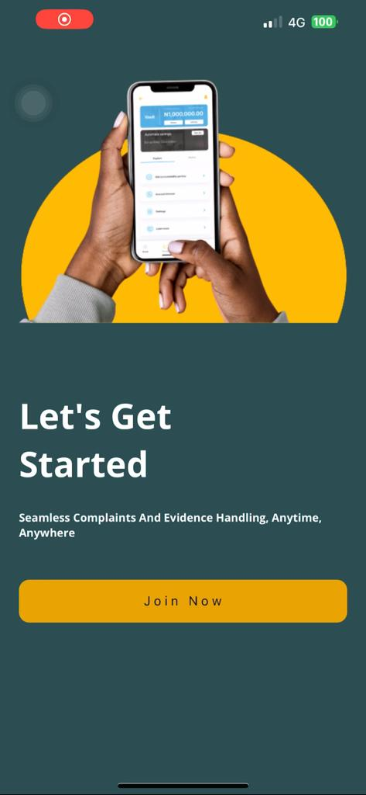
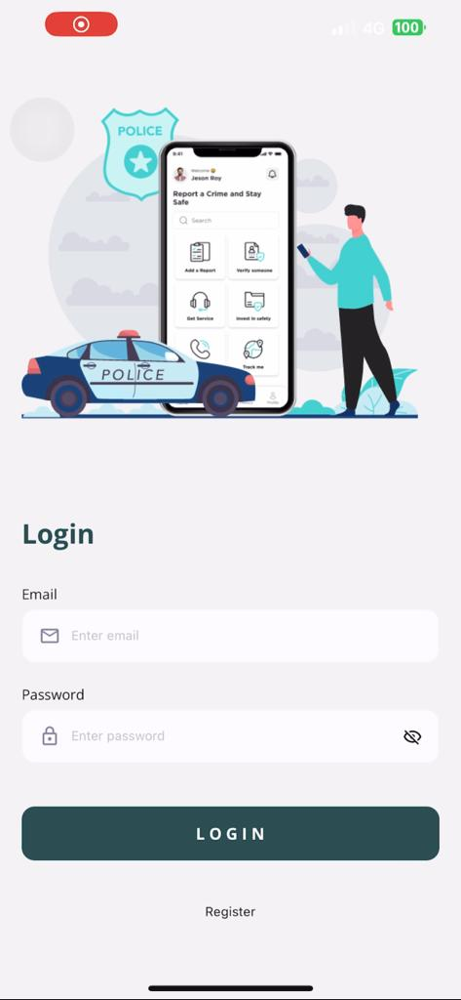
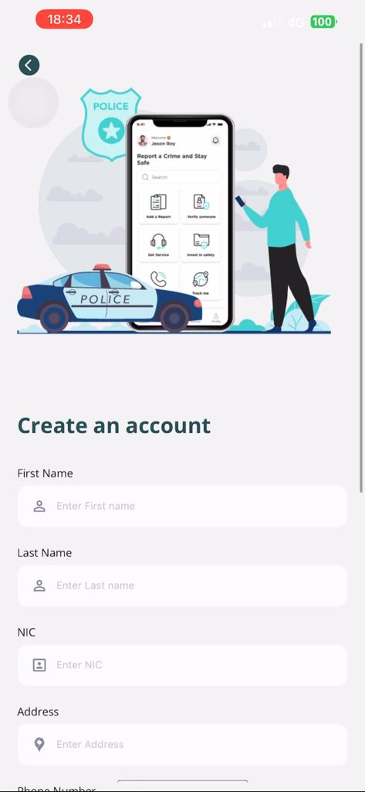
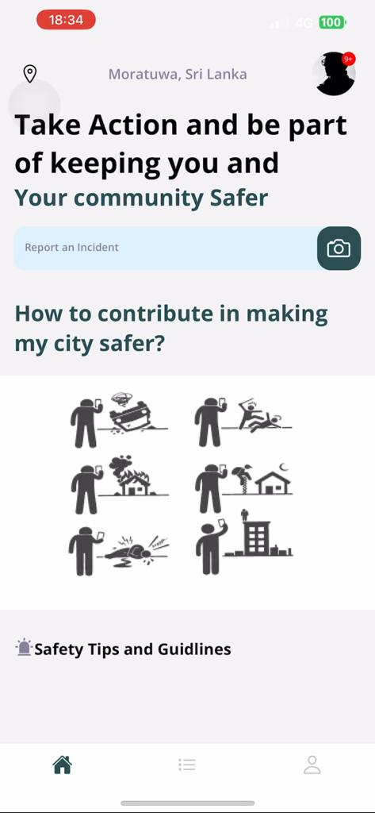
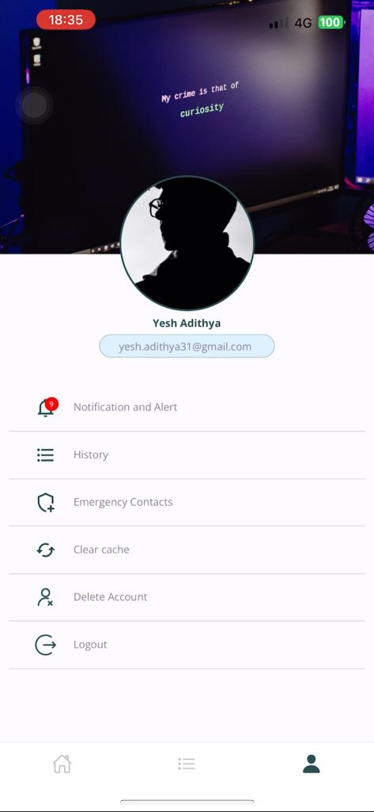
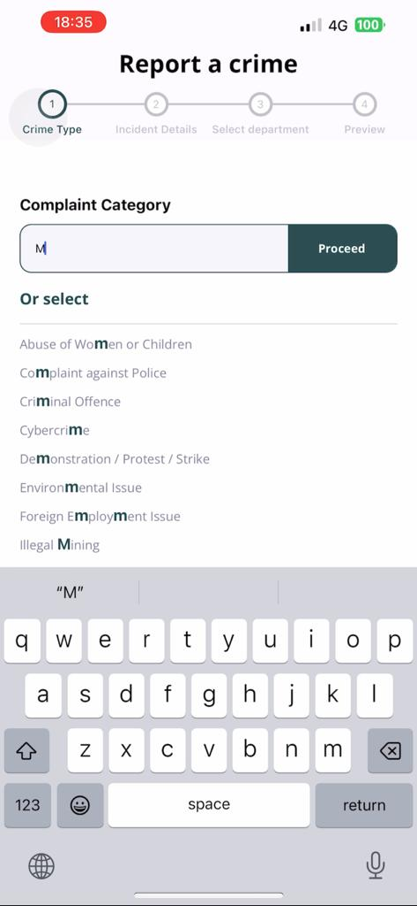
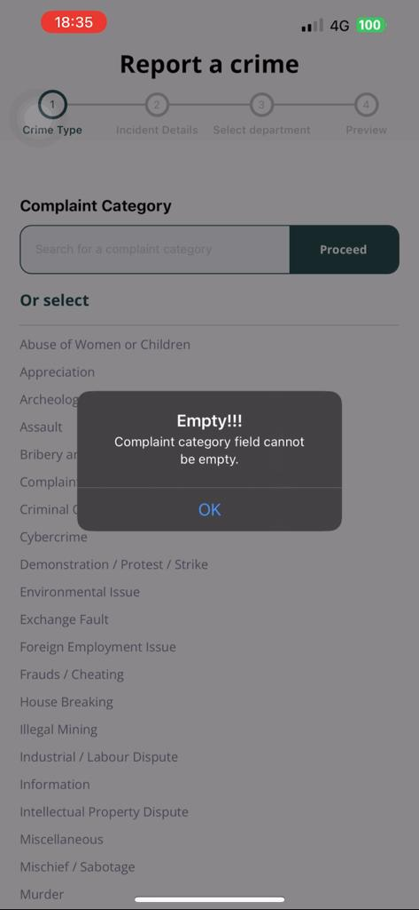
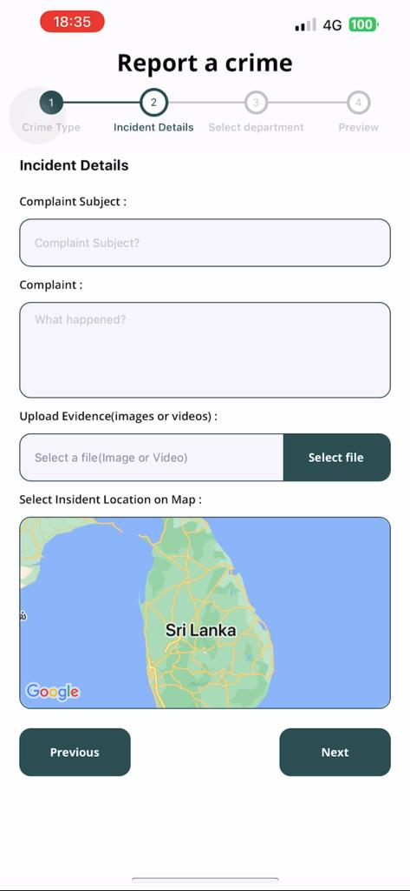

<a name="readme-top"></a>

<!-- ABOUT THE PROJECT -->

## About The Project

### React-Native CRIME Uploading Mobile App using REST-API Integration
How It works: [Watch Video](https://drive.google.com/file/d/1hfYGlrH3jd5G1w53WtDTnbcK0twxHNNp/view?usp=sharing)
- Login, Registration, Splash Screens
  <div style="display: flex; justify-content: space-between; height: 550px;">
    
    
    
  </div>

- Home Screen, Profile Screen
  <div style="display: flex; justify-content: space-between; height: 550px;">
    
    
  </div>

- Crime Reporting Screen
  <div style="display: flex; justify-content: space-between; height: 550px;">
    
    
    
  </div>

<p align="right">(<a href="#readme-top">back to top</a>)</p>

### Built With

Here this Crime uploading Mobile Application, it create using React-native mobile Framework, REST_API and Database using MONGO DB.

- [![react-document][React Native]][react-document]
- ![REST API][REST API]

<p align="right">(<a href="#readme-top">back to top</a>)</p>

<!-- GETTING STARTED -->

## Getting Started

### Prerequisites

Install Expo CLI:
* Run the following command to install Expo CLI globally:

- Using npm:
  ```sh
  npm install -g expo-cli
  ```
- Using yarn:
  ```sh
  yarn global add expo-cli
  ```

Verify Installation:
- After the installation is complete, you can verify it by checking the installed version:
  ```sh
  expo --version
  ````

### Installation

_This is the step you have to follow._

1. Clone the repositery
    ```sh
    git clone [https://github.com/Yesh-adithya31/furniture-app.git](https://github.com/Yesh-adithya31/SEProject.git)
    ````

2. Install npm packages
   ```sh
   npm install
   ```
3. Run cloned project

- Using npm:
   ```sh
   npx expo start
   ```
- Using yarn:
   ```sh
   yarn expo start
   ```

<p align="right">(<a href="#readme-top">back to top</a>)</p>

<!-- MARKDOWN LINKS & IMAGES -->

[react-document]: https://facebook.github.io/react-native/
[React Native]: https://img.shields.io/badge/React_Native-61DAFB?style=for-the-badge&logo=react&logoColor=white
[REST API]: https://img.shields.io/badge/REST_API-Your_Color?style=for-the-badge

